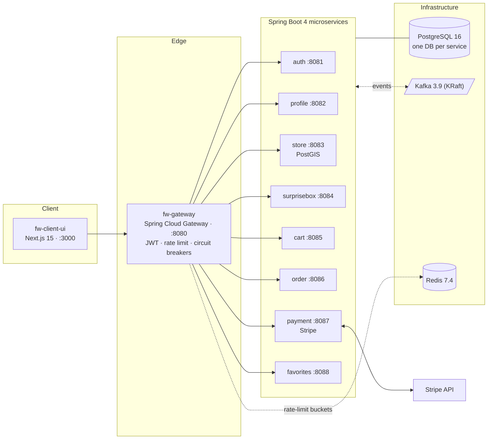

# FoodWise


> **A food-rescue marketplace**: people buy "surprise boxes" of unsold-but-good food
> from local bakeries, restaurants and grocery stores at 30–70% off.
> Nine Spring Boot microservices + a Next.js PWA, fully orchestrated with Docker Compose.

This is the **platform repository**: it holds the architecture overview, the
`docker-compose.yml` that runs the whole system locally, database bootstrap scripts
and demo-data seeding. Each microservice lives in its own repository (linked below).

---

## Table of Contents

- [Architecture](#architecture)
- [Services](#services)
- [Quick Start (Docker)](#quick-start-docker)
- [Demo Data](#demo-data)
- [Engineering Highlights](#engineering-highlights)
- [CI/CD](#cicd)
- [Local Development (without Docker)](#local-development-without-docker)
- [Working on a Single Service](#working-on-a-single-service)
- [This Repository](#this-repository)

---

## Architecture



Key rules of the topology:

- **The gateway is the only public entry point.** It validates JWTs, strips inbound
  `X-User-*` headers (anti-spoofing) and propagates trusted `X-User-Id` / `X-User-Roles`
  downstream. Service ports are reachable only inside the Docker network.
- **Database-per-service.** One PostgreSQL instance, but each service owns its own
  database and credentials (`init-databases.sh`). No shared tables, ever.
- **Async over Kafka, sync over REST.** Domain events (`user.created`, `order.created`,
  `payment.completed`, …) flow through Kafka with retry + dead-letter topics; synchronous
  lookups go through Resilience4j-wrapped REST clients.

## Services

Each repository has its own README with API tables, event contracts, data model and
engineering notes — start with whichever domain interests you.

| Repository | Port | Gateway routes | What it does |
|---|---|---|---|
| [fw-gateway](https://github.com/tapok332/fw-gateway) | 8080 | — | Single entry point: JWT validation, header propagation, Redis rate limiting, per-route circuit breakers, CORS |
| [fw-auth-service](https://github.com/tapok332/fw-auth-service) | 8081 | `/auth/**` | Registration, login, Google/Apple OAuth, refresh-token rotation, `user.created` events via transactional outbox |
| [fw-profile-service](https://github.com/tapok332/fw-profile-service) | 8082 | `/profiles/**`, `/addresses/**` | User profiles and addresses; auto-created from `user.created`; avatar storage |
| [fw-store-service](https://github.com/tapok332/fw-store-service) | 8083 | `/stores/**`, `/categories/**`, `/menu-items/**`, `/promos/**`, `/home/**` | Store catalog, menus, promos, reviews; PostGIS geo search (`nearby`, radius, distance sort) |
| [fw-surprisebox-service](https://github.com/tapok332/fw-surprisebox-service) | 8084 | `/surprise-boxes/**` | Surprise-box inventory and reservations with expiry; oversell-safe stock decrements |
| [fw-cart-service](https://github.com/tapok332/fw-cart-service) | 8085 | `/cart/**` | Server-side cart, single-store invariant, server-resolved prices (client never sends a price) |
| [fw-order-service](https://github.com/tapok332/fw-order-service) | 8086 | `/orders/**` | Checkout orchestration: validation, server-side price recompute, ownership enforcement, order-first Stripe flow, status lifecycle |
| [fw-payment-service](https://github.com/tapok332/fw-payment-service) | 8087 | `/payments/**`, `/payment-methods/**` | Stripe Payment Intents, signature-verified webhooks, refunds, `payment.completed/failed` events |
| [fw-favorites-service](https://github.com/tapok332/fw-favorites-service) | 8088 | `/favorites/**` | User's favorite stores: idempotent add/remove, list, check |
| [fw-common](https://github.com/tapok332/fw-common) | — | — | Shared library: security filters, `Money` value object, Kafka serde + DLT error handling, tracing, DTO contracts |
| [fw-client-ui](https://github.com/tapok332/fw-client-ui) | 3000 | — | Next.js 15 consumer PWA: discovery, cart, checkout with Stripe Elements, uk/en i18n, documented [design system](https://github.com/tapok332/fw-client-ui/blob/main/DESIGN-SYSTEM.md) |

## Quick Start (Docker)

The whole platform runs locally with a single `docker compose up`. You need
**Docker Desktop** (or Docker Engine + Compose v2) and **git** — nothing else.

### 1. Clone the platform and all service repositories

`docker-compose.yml` expects every service checked out next to it:

```bash
git clone https://github.com/tapok332/foodwise-platform.git
cd foodwise-platform

for r in fw-common fw-gateway fw-auth-service fw-profile-service fw-store-service \
         fw-surprisebox-service fw-cart-service fw-order-service fw-payment-service \
         fw-favorites-service fw-client-ui; do
  git clone "https://github.com/tapok332/$r.git"
done
```

### 2. Create your `.env`

```bash
cp .env.example .env

# Generate the mandatory secrets (never reuse one value twice):
printf 'JWT_SECRET_ACCESS=%s\n'        "$(openssl rand -base64 32)" >> .env
printf 'JWT_SECRET_REFRESH=%s\n'       "$(openssl rand -base64 32)" >> .env
printf 'INTERNAL_SERVICE_SECRET=%s\n'  "$(openssl rand -base64 32)" >> .env

# Per-service database passwords:
for svc in AUTH PROFILE STORE SURPRISEBOX CART ORDER PAYMENT FAVORITES; do
  printf '%s_DB_PASSWORD=%s\n' "$svc" "$(openssl rand -base64 24)" >> .env
done
```

`.env.example` documents every variable; `.env` is gitignored.

### 3. (Optional) Wire up Stripe

For the end-to-end payment flow, put test keys from the
[Stripe dashboard](https://dashboard.stripe.com/test/apikeys) into `.env`:

```
STRIPE_SECRET_KEY=sk_test_...
STRIPE_PUBLISHABLE_KEY=pk_test_...
NEXT_PUBLIC_STRIPE_PUBLISHABLE_KEY=pk_test_...
STRIPE_WEBHOOK_SECRET=whsec_...
```

Without keys, ordering still works — payment falls back to a simulated success path.

### 4. Start the stack

```bash
docker compose up -d
```

First boot builds 9 service jars and the Next.js image (a few minutes); subsequent
starts are near-instant. Postgres is initialized on first boot by
`init-databases.sh` (per-service databases + scoped users, passwords from your `.env`), Kafka runs in KRaft mode (no ZooKeeper).

### 5. Verify

```bash
# Gateway is the only externally exposed API endpoint
curl -i http://localhost:8080/actuator/health   # → {"status":"UP"}

# The app
open http://localhost:3000
```

| URL | What |
|---|---|
| `http://localhost:3000` | FoodWise PWA |
| `http://localhost:8080` | API gateway (all REST traffic goes through here) |
| `http://localhost:8080/stores?lat=50.4501&lng=30.5234` | Example: geo store search |

To tear everything down: `docker compose down` (add `-v` to also drop the database volume).

## Demo Data

An empty marketplace is boring. `seed.sh` populates the dev database through the
public REST API (the same way a real client would):

```bash
./seed.sh        # requires the stack to be up; targets http://localhost:8080
```

It registers users, promotes one to admin, then creates categories, stores, menu
items, promos and surprise boxes. Re-running is safe — entities are timestamp-suffixed.

## Engineering Highlights

A non-exhaustive tour of what this codebase demonstrates; details live in the
service READMEs.

**Security**
- JWT at the edge, identity propagation via trusted headers, inbound spoofing stripped
  ([fw-gateway](https://github.com/tapok332/fw-gateway))
- XSS-safe token storage: refresh token in an `HttpOnly; SameSite=Strict` cookie,
  access token in frontend memory only — no JWT in `localStorage`
  ([fw-auth-service](https://github.com/tapok332/fw-auth-service))
- IDOR prevention: every order/cart/profile read is ownership-checked against
  `X-User-Id`
- Prices are **never** accepted from the client — carts and orders recompute them
  server-side
- Unified login error + timing parity against user enumeration
- Secrets via environment with dev-safe fallbacks, no credentials in git

**Reliability**
- Kafka consumers use retry + dead-letter topics instead of silent ack-on-error,
  shared via one config in [fw-common](https://github.com/tapok332/fw-common)
- Transactional outbox for event publishing (idempotent producers, `acks=all`)
- Inter-service REST calls wrapped in Resilience4j circuit breakers with typed 4xx
  mapping — an unknown `storeId` at checkout is a clean `404`, not a `500`
- Oversell-safe inventory decrements on surprise-box reservations

**Domain & correctness**
- A single `Money` value object (minor units + ISO-4217) flows through entities,
  events, REST and Stripe — no floating-point money, no unit-mismatch bugs
- PostGIS-backed geo search with validated query contracts (unknown sort field → `400`)
- Order-first payment flow: `POST /orders` returns a Stripe `clientSecret`, the webhook
  closes the loop ([fw-order-service](https://github.com/tapok332/fw-order-service))

**Frontend**
- Server-authoritative cart with optimistic mutations + rollback, guest-cart replay on
  login, cross-tab sync via `BroadcastChannel`
  ([fw-client-ui](https://github.com/tapok332/fw-client-ui))
- Documented design system: tokens, voice, motion rules
  ([DESIGN-SYSTEM.md](https://github.com/tapok332/fw-client-ui/blob/main/DESIGN-SYSTEM.md))

## CI/CD

Every repository ships a GitHub Actions pipeline:

| Repository | Workflow | What it runs |
|---|---|---|
| All Java services | `ci.yml` | Checks out the service **and** `fw-common` side by side (the same sibling layout the local build uses), builds `fw-common`, then `./gradlew build` — compilation + full unit/slice test suite on every push and PR. Test reports are uploaded as artifacts. |
| `fw-common` | `ci.yml` | `./gradlew build` with tests. |
| `fw-client-ui` | `ci.yml` | `npm ci` → type check → ESLint → Vitest → production `next build`. |

## Local Development (without Docker)

`./gradlew bootRun` from any service repository works out of the box — every
`application.yml` carries dev-safe defaults pointing at `localhost`. You only need
`.env` when going through Docker Compose.

Prerequisites:

- **JDK 25** (Gradle toolchain)
- **PostgreSQL 16 + PostGIS** on `:5432`, initialized with `init-databases.sh`
- **Kafka 3.x** on `:9092` — or reuse the Compose one and stop just the Spring service
- **Redis 7.x** on `:6379` (gateway rate-limit buckets only)
- **Node 20+** for `fw-client-ui` (`npm install && npm run dev`)

A convenient hybrid: `docker compose up -d postgres kafka redis` for infrastructure,
then run the service you're working on from the IDE.

## Working on a Single Service

The day-to-day loop after the stack is up:

```bash
# 1. Change code in a service, then run its tests
cd fw-order-service && ./gradlew test

# 2. Rebuild and restart just that container (everything else keeps running)
cd .. && docker compose up -d --build order-service

# 3. Tail its logs
docker logs -f foodwise-order
```

Useful endpoints while developing:

- **Swagger UI** per service (dev only): start with `SWAGGER_ENABLED=true`, then
  open `http://localhost:<service-port>/swagger-ui.html` (ports in the
  [Services](#services) table; service ports are exposed only outside Docker —
  use `./gradlew bootRun` or map the port).
- **Smoke-test through the gateway**, not service ports — that is the only path
  clients use: `curl http://localhost:8080/stores`.
- **fw-client-ui hot reload:** `cd fw-client-ui && npm install && npm run dev`
  (port 9002, talks to the gateway on 8080).

Changes to `fw-common` require rebuilding it first (`cd fw-common && ./gradlew build`)
— services consume its jar from the sibling directory.

## This Repository

```
docker-compose.yml      one-command local orchestration of the whole platform
init-databases.sh       creates per-service databases and scoped users (first boot)
.env.example            canonical env template (copy to .env)
seed.sh                 demo data via the public REST API
```

Service repositories are cloned alongside (see [Quick Start](#quick-start-docker)) —
the compose file builds each image from its sibling directory.

---

*Portfolio project. No public deployment — everything is designed to be reviewed
locally with `docker compose up`.*
